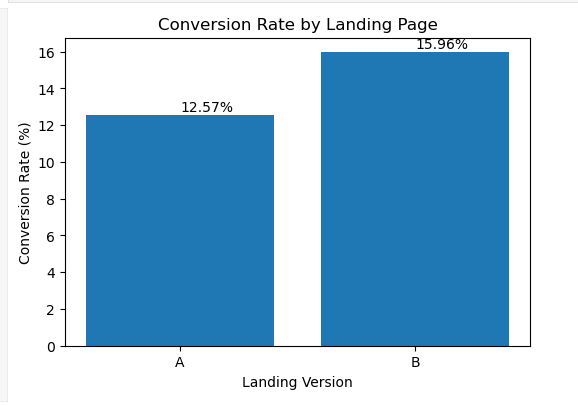
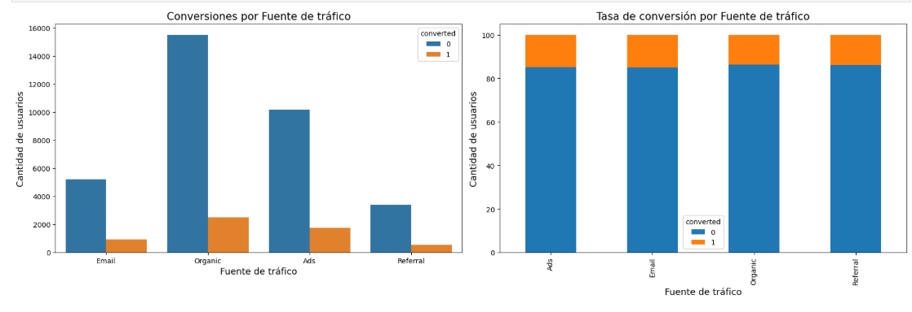
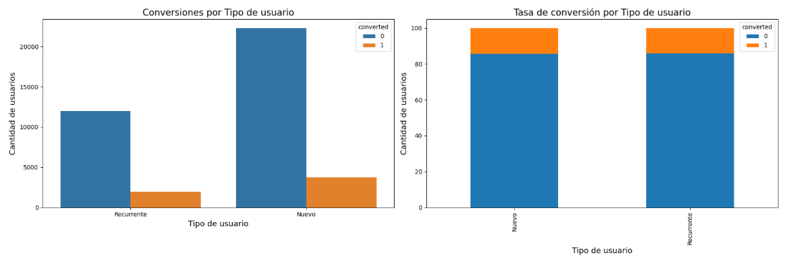

# 🧪 Landing Page A/B Testing Analysis

This project analyzes an **A/B experiment on an ecommerce landing page** to determine which version generates better business outcomes in terms of **conversion rate** and **average customer spending**.

The analysis combines **statistical hypothesis testing, behavioral segmentation, and business interpretation** to support data-driven decision-making for marketing and growth teams.

---

## 📌 Business Objective

The company launched an **A/B test** comparing two landing page versions (**A and B**) to improve:

- conversion rate
- average spending per converted user
- customer behavior understanding across traffic channels and user segments

The objective was to recommend the best landing page version using statistical evidence.

---

## 🛠 Tools & Technologies

- Python
- Pandas
- SciPy
- Statsmodels
- Seaborn
- Matplotlib
- Jupyter Notebook

---

## 🔍 Project Workflow

### 1. Data Validation & Exploration

The experiment dataset was explored and validated to ensure:

- data consistency
- balanced A/B groups
- proper variable structure
- conversion and spending logic

This step ensured confidence in the experiment design before applying statistical methods.

---

### 2. Spending Comparison (A vs B)

A statistical comparison of **average spending among converted users** was performed using an **independent t-test**.

The analysis focused only on converted users to avoid distortion from zero-spending observations.

---

### 3. Conversion Rate Analysis

Landing page versions were compared through:

- conversion rate calculations
- **Two-Proportion Z-Test**

This allowed validation of whether observed conversion differences were statistically significant.

---

### 4. Behavioral Segmentation

Additional analysis explored conversion behavior by:

- traffic source
- user type (new vs returning)

**Chi-square tests** were used to evaluate whether conversion patterns varied significantly between groups.

---

## 📊 Analysis Preview

### A/B Conversion Rate Comparison

Visual comparison of conversion performance between landing page versions.

The analysis shows a higher conversion rate for version **B**, later validated through statistical testing.

---

### Conversion by Traffic Source

Grouped and stacked bar analysis used to understand how conversion behavior changes across acquisition channels.

The results suggest meaningful differences in performance depending on traffic source.

---

### Conversion by User Type

Analysis comparing conversion behavior between **new and returning users**.

This segmentation helps identify opportunities for personalized marketing strategies.

---

## 📈 Key Findings

- Landing page **B outperformed A in conversion rate**.
- Statistical testing confirmed that observed conversion differences were **highly significant**.
- Traffic source influenced conversion behavior.
- User type revealed behavioral differences between new and returning customers.
- Statistical evidence supported a data-driven recommendation for landing page implementation.

---

## 💡 Business Recommendation

The analysis supports implementing **Landing Page B**, given its stronger conversion performance and statistically significant results.

Additional recommendations include:

- optimizing high-performing acquisition channels
- personalizing experiences by user segment
- continuing experimentation to validate future improvements

---

## ⚠️ Limitations

- Results correspond only to the analyzed experiment period.
- Statistical significance does not automatically imply large business impact.
- External variables not included in the experiment may influence behavior.

---

## 🎯 Key Skills Demonstrated

- A/B Testing
- Statistical Hypothesis Testing
- Conversion Analysis
- Exploratory Data Analysis (EDA)
- Data Visualization
- Business Decision-Making
- Statistical Interpretation

---

## 📓 Notebook

The complete step-by-step statistical analysis is available in the Jupyter Notebook included in this repository.

---

## 🔗 Portfolio

- Notion Portfolio: https://www.notion.so/Landing-Page-A-B-Testing-Validaci-n-de-hip-tesis-de-negocio-36bddeb9784680a9b790e9e37eb62394?source=copy_link
